# Sequence Diagram: Student Learning Course Content

## Mô tả
Sơ đồ sequence mô tả luồng học viên học nội dung khóa học, bao gồm:
- Xem danh sách modules của khóa học
- Xem danh sách lessons trong module
- Hoàn thành lesson (cập nhật tiến độ học tập)
- Xem danh sách assignments của khóa học
- Nộp assignment (cập nhật tiến độ học tập)

## Sequence Diagram

```mermaid
sequenceDiagram
    participant Student as Student (Frontend)
    participant ModuleController as ModuleController
    participant ModuleService as ModuleService
    participant ModuleRepo as ModuleRepository
    participant LessonController as LessonController
    participant LessonService as LessonService
    participant LessonRepo as LessonRepository
    participant LessonCompletionController as LessonCompletionController
    participant LessonCompletionService as LessonCompletionService
    participant LessonCompletionRepo as LessonCompletionRepository
    participant AssignmentController as AssignmentController
    participant AssignmentService as AssignmentService
    participant AssignmentRepo as AssignmentRepository
    participant AssignmentQuizController as AssignmentQuizController
    participant AssignmentSubmissionService as AssignmentSubmissionService
    participant AssignmentSubmissionRepo as AssignmentSubmissionRepository
    participant LearningProcessService as LearningProcessService
    participant LearningProcessRepo as LearningProcessRepository

    Note over Student,LearningProcessRepo: ===== 1. STUDENT XEM MODULES CỦA KHÓA HỌC =====
    Student->>ModuleController: GET /api/v1/modules/IdAndPublic?courseId={courseId}
    ModuleController->>ModuleService: findByCourseIdAndIsPublicTrue(courseId)
    ModuleService->>ModuleRepo: findAllByCourse_CourseIdAndIsPublicTrue(courseId)
    ModuleRepo-->>ModuleService: List<Module>
    ModuleService-->>ModuleController: List<ModuleDtoRes>
    ModuleController-->>Student: Response: Danh sách modules

    Note over Student,LearningProcessRepo: ===== 2. STUDENT XEM LESSONS TRONG MODULE =====
    Student->>LessonController: GET /api/v1/lessons/IdAndPublic?moduleId={moduleId}
    LessonController->>LessonService: getLessonsByModuleIdAndIsPublicTrue(moduleId)
    LessonService->>LessonRepo: findByModule_ModuleIdAndIsPublicTrue(moduleId)
    LessonRepo-->>LessonService: List<Lesson>
    LessonService-->>LessonController: List<LessonDtoRes>
    LessonController-->>Student: Response: Danh sách lessons

    Note over Student,LearningProcessRepo: ===== 3. STUDENT HOÀN THÀNH LESSON =====
    Student->>LessonCompletionController: POST /api/v1/lessonsCompletion/{lessonId}/complete
    LessonCompletionController->>LessonCompletionService: completeLesson(lessonId, userDetail)
    
    alt Lesson chưa được hoàn thành
        LessonCompletionService->>LessonCompletionRepo: existsByUser_UserIdAndLesson_LessonId(userId, lessonId)
        LessonCompletionRepo-->>LessonCompletionService: false
        
        LessonCompletionService->>LessonRepo: findById(lessonId)
        LessonRepo-->>LessonCompletionService: Lesson
        
        LessonCompletionService->>LessonCompletionRepo: save(LessonCompletion)
        LessonCompletionRepo-->>LessonCompletionService: LessonCompletion saved
        
        Note over LessonCompletionService,LearningProcessService: Cập nhật tiến độ học tập
        LessonCompletionService->>LearningProcessService: increaseProgress(courseId, userDetail)
        LearningProcessService->>LearningProcessRepo: increaseProgress(userId, courseId)
        Note over LearningProcessRepo: UPDATE LearningProgress<br/>SET completedTasks = completedTasks + 1,<br/>progressPercent = ((completedTasks + 1) * 100.0 / totalTasks)
        LearningProcessRepo-->>LearningProcessService: Progress updated
        LearningProcessService-->>LessonCompletionService: Progress increased
    else Lesson đã được hoàn thành
        LessonCompletionService->>LessonCompletionRepo: existsByUser_UserIdAndLesson_LessonId(userId, lessonId)
        LessonCompletionRepo-->>LessonCompletionService: true
        Note over LessonCompletionService: Return early (không làm gì)
    end
    
    LessonCompletionService-->>LessonCompletionController: void
    LessonCompletionController-->>Student: 200 OK

    Note over Student,LearningProcessRepo: ===== 4. STUDENT XEM ASSIGNMENTS CỦA KHÓA HỌC =====
    Student->>AssignmentController: GET /api/v1/assignments/courses/{courseId}/assignments
    AssignmentController->>AssignmentService: findByCourseId(courseId)
    AssignmentService->>AssignmentRepo: findByCourse_CourseId(courseId)
    AssignmentRepo-->>AssignmentService: List<Assignment>
    AssignmentService-->>AssignmentController: List<AssignmentDtoRes>
    AssignmentController-->>Student: Response: Danh sách assignments

    Note over Student,LearningProcessRepo: ===== 5. STUDENT NỘP ASSIGNMENT (QUIZ) =====
    Student->>AssignmentQuizController: POST /api/v1/assignments/{assignmentId}/submit-quiz
    AssignmentQuizController->>AssignmentSubmissionService: submitQuizAnswers(assignmentId, userDetail, request)
    
    AssignmentSubmissionService->>AssignmentRepo: findById(assignmentId)
    AssignmentRepo-->>AssignmentSubmissionService: Assignment
    
    AssignmentSubmissionService->>AssignmentSubmissionRepo: findByAssignment_AssignmentIdAndStudent_UserId(assignmentId, userId)
    AssignmentSubmissionRepo-->>AssignmentSubmissionService: AssignmentSubmission (existing or null)
    
    alt Submission đã tồn tại
        Note over AssignmentSubmissionService: Xóa old answers và cập nhật submission
        AssignmentSubmissionService->>AssignmentSubmissionRepo: save(updated submission)
    else Submission mới
        Note over AssignmentSubmissionService: Tạo submission mới
        AssignmentSubmissionService->>AssignmentSubmissionRepo: save(new submission)
    end
    
    AssignmentSubmissionRepo-->>AssignmentSubmissionService: AssignmentSubmission saved
    
    Note over AssignmentSubmissionService,LearningProcessService: Cập nhật tiến độ học tập (nếu assignment được chấm điểm)
    Note over AssignmentSubmissionService: Note: Learning progress chỉ được cập nhật<br/>khi assignment được giáo viên chấm điểm
    
    AssignmentSubmissionService-->>AssignmentQuizController: QuizResultDtoRes
    AssignmentQuizController-->>Student: Response: Kết quả quiz

    Note over Student,LearningProcessRepo: ===== 6. STUDENT XEM TIẾN ĐỘ HỌC TẬP =====
    Student->>LearningProcessService: getByCourseAndUser(courseId, userDetail)
    LearningProcessService->>LearningProcessRepo: findByUser_UserIdAndCourse_CourseId(userId, courseId)
    LearningProcessRepo-->>LearningProcessService: LearningProgress
    
    LearningProcessService->>LessonRepo: countLessonsByCourseId(courseId)
    LessonRepo-->>LearningProcessService: totalLessons
    
    LearningProcessService->>AssignmentRepo: countByCourse_CourseId(courseId)
    AssignmentRepo-->>LearningProcessService: totalAssignments
    
    Note over LearningProcessService: Tính toán:<br/>totalTasks = totalLessons + totalAssignments<br/>progressPercent = (completedTasks * 100.0 / totalTasks)
    
    LearningProcessService-->>Student: LearningProcessDtoRes<br/>(totalTasks, completedTasks, progressPercent, status)
```

## Các thành phần chính

### 1. Module Flow
- **Endpoint**: `GET /api/v1/modules/IdAndPublic?courseId={courseId}`
- **Service**: `ModuleService.findByCourseIdAndIsPublicTrue()`
- **Repository**: `ModuleRepository.findAllByCourse_CourseIdAndIsPublicTrue()`

### 2. Lesson Flow
- **Endpoint**: `GET /api/v1/lessons/IdAndPublic?moduleId={moduleId}`
- **Service**: `LessonService.getLessonsByModuleIdAndIsPublicTrue()`
- **Repository**: `LessonRepository.findByModule_ModuleIdAndIsPublicTrue()`

### 3. Lesson Completion Flow
- **Endpoint**: `POST /api/v1/lessonsCompletion/{lessonId}/complete`
- **Service**: `LessonCompletionService.completeLesson()`
- **Repository**: `LessonCompletionRepository.save()`
- **Learning Progress**: Tự động cập nhật qua `LearningProcessService.increaseProgress()`

### 4. Assignment Flow
- **View Assignments**: `GET /api/v1/assignments/courses/{courseId}/assignments`
- **Submit Quiz**: `POST /api/v1/assignments/{assignmentId}/submit-quiz`
- **Service**: `AssignmentSubmissionService.submitQuizAnswers()`
- **Repository**: `AssignmentSubmissionRepository.save()`

### 5. Learning Progress Flow
- **Service**: `LearningProcessService`
- **Repository**: `LearningProcessRepository`
- **Cập nhật tự động khi**:
  - Student hoàn thành lesson
  - Assignment được giáo viên chấm điểm (thông qua grading process)

## Lưu ý quan trọng

1. **Learning Progress** được tạo tự động khi student enroll vào khóa học
2. **Lesson Completion** tự động cập nhật learning progress ngay khi student hoàn thành
3. **Assignment Submission** chỉ cập nhật learning progress khi được giáo viên chấm điểm (không hiển thị trong diagram này)
4. Tất cả các API đều kiểm tra `isPublic = true` để đảm bảo chỉ hiển thị nội dung công khai
